# Generating Upper-Body Motion for Real-Time Characters Making their Way through Dynamic Environments

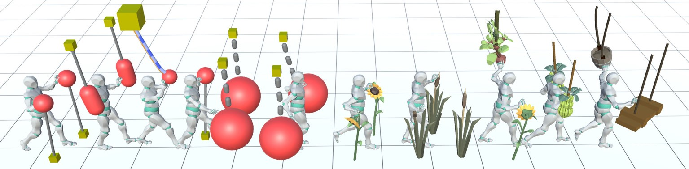

- [Introduction](#introduction)
- [Generating Upper-Body Motion for Real-Time](#generating-upper-body-motion-for-real-time)
- [Instructions](#instructions)
- [Results](#results)
- [Citation](#citation)
- [Links](#links)
- [License](#license)

<a name="Introduction"></a>
## Introduction

This repository provides the codes used to reproduce the results shown in the following paper: **Generating Upper-Body Motion for Real-Time Characters Making their Way through Dynamic Environments**. Eduardo Alvarado, Damien Rohmer, Marie-Paule Cani.

This system takes as input a character model, ie. a mesh geometry with a rigged skeleton being animated by an arbitrary kinematic animation (e.g., keyframed clip, MoCap data) in order to build a responsive, partial physically-based version of the input skeleton. This real-time model allows to genereate plausible upper-body interactions from single motion clips, regardless of the nature of the environment, including non-rigid obstacles such as vegetation.

In order to reproduce two-ways interactions between the upper-body and the environment, we rely on a hybrid method for character animation that couples a keyframed sequence with kinematic constraints (IK) and lightweight physics for each limb independently. The dynamic response of the character’s upper-limbs leverages antagonistic controllers, allowing us to tune tension/relaxation in the upper-body without diverging from the reference keyframe motion. A new sight model, controlled by procedural rules, enables high-level authoring of the way the character generates interactions by adapting its stiffness and reaction time. As results show, our real-time method
offers precise and explicit control over the character’s behavior and style, while seamlessly adapting to new situations. Our model is therefore well suited for gaming applications.

<p align="center">
  
</p>
<p align="center"><em>Figure 1: Examples of two-ways interactions with different obstacles. Left: Baseline animation. Right: Ours.</em></p>

<a name="steps"></a>
## Generating Upper-Body Motion for Real-Time

We propose a hybrid character model for upper-body interactions that merges both, a kinematic input animation and lightweight physics. Our anchor system aims to blend both, in a way that is simple for the user to define which limbs are affected by physics during the animation. For example, you can decide that your torso follows the kinematic animation, while the head, or one arm, is fully driven by physics. The decision on which limbs are simulated is driven by the anchor *a* and remains fully dynamic, and can be activated or deactivated at run-time for each body part.

<p align="center">
  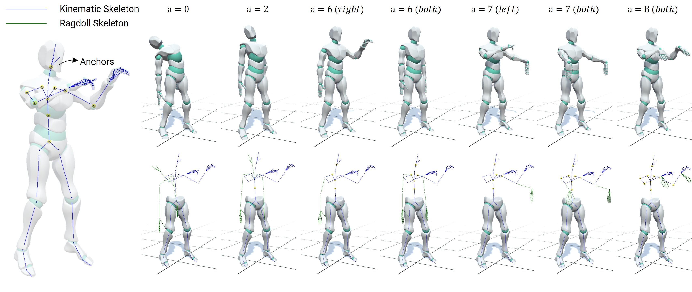
</p>
<p align="center"><em>Figure 2: Different anchor configurations for our hybrid model.</em></p>

<p align="center">
  
</p>
<p align="center"><em>Figure 3: Applying our hybrid model to an arbitrary animation.</em></p>

Then, our goal is to not only having a passive physical version of the chosen limb, but actuated based. PD controllers are able to convert an angular error to a spring-like force with certain stiffness to do this. However, setting a fixed value of tension though its gains do not allow the skeleton to reach preciselly a target orientation while external torques are applied, such as the effect of weight. On the other hand, changing the gains over time to minimize the error do also change the stiffness, and therefore the style of the motion. For this purpose, we rely on antagonistic controllers. This controllers guarantee to reach an equilibrium at any arbitrary target orientation, while preserving the motion style by decoupling stiffness and position control.

<p align="center">
  
</p>
<p align="center"><em>Figure 4: Actuated physical limb using antagonistric controllers. The target orientation remains unchanged while we modify the amount of muscular tension.</em></p>

In a final step, we need to make the character aware of its surroundings. To leverage our antagonisic control, we now use an anticipation approach based on ray-casting and a set of procedural rules to modify the kinematic skeleton, and consequently driving the active ragdoll skeleton, resulting therefore in a responsive skeleton version of the original key-framed animation.

<p align="center">
  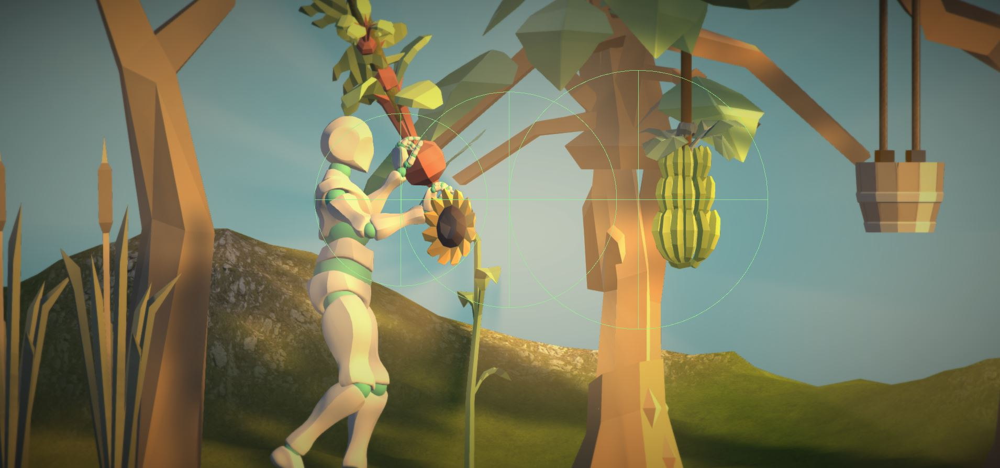
</p>
<p align="center"><em>Figure 5: Our anticipation system detects the obstacles in front of the character and collects the metadata from the environment.</em></p>

The anticipation system can be as well use to model a linear relationship between the mass information of the objects coming from the metadata of the environment and the amount of stiffness in our antagonistic control, making gestures stiffer when the character anticipates to act against heavier obstacles, or more relaxed when it acts against elements that it anticipates to be lighter. The set of procedural rules allows us to adapt the reaction time of the character too, based on the object's velocity.

<p align="center">
  
&nbsp; &nbsp;
  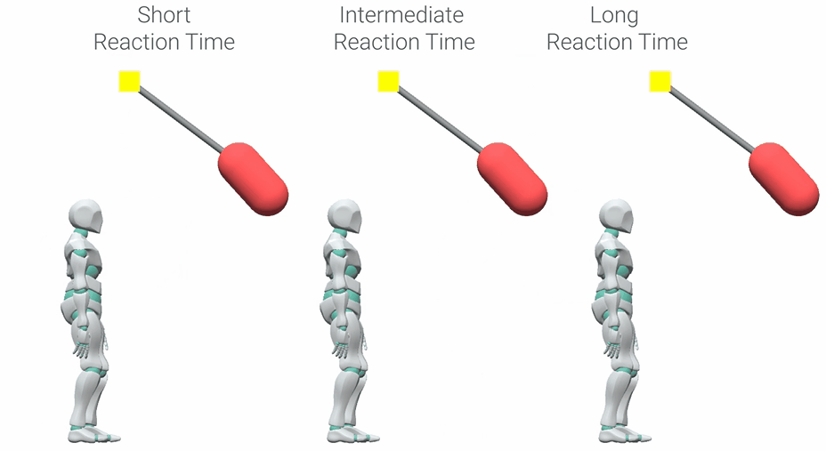
</p>
<p align="center"><em>Figure 6: Left: Adapting the muscular rigidity to interact with heavier obstacles. Right: Changing the reaction time.</em></p>

*For more information about the method and mathematical background behind the approach, please refer to the paper.*

<a name="Instructions"></a>
## Instructions

The repository contains all the necessary assets to run the project without additional material. The last version has been tested on the **Unity version 2021.3.5f1**. Inside the `Assets`, the following structure is introduced:

    .
    ├── ...
    ├── Assets 
    │   ├── ...		
    │   ├── Demos                               # Simpler scenes to show antagonistic controllers, IK or Quaternion operations
    │   ├── Characters                          # Character models containing meshes, animation clips and rigs
    │   ├── Environment                         # Elements for the environment: Dynamic obstacles, meshes, materials and so on
    │   ├── Scenes (Examples)                   # Scenes ready-to-use. Make sure you use the final scenes in the "Examples" folder! Others are experimental.
    │   │     ├── ...         
    │   │     ├── Scene - Basic                 # Simpler scenes to experiment with interactions (shown in image)
    │   │     ├── Scene - Outdoor Environment   # Natural Environment containing the natural assets
    │   │     └── ...         
    │   ├── Scripts                             # .cs scripts
    │   └── ...                
    ├── Docs
    ├── ...				
    ├── README.md
    └── LICENSE

Go to `Assets > Scenes > Examples` and open the `Scene - Basic` scene. Click in the **play button**, and after that, you will be able to control the character with the keyboard or gamepad. In the `Game` window, you will find an environment where you can move your third-person character, along with an the surrounding elements to be observed and manipulated.

<p align="center">
  
  &nbsp; &nbsp;
  
</p>
<p align="center"><em>Figure 7: Scene - Basic.</em></p>

The character is composed of three simultaneous models:
* **Kinematic**: Contains a state-machine with keyframed motion clips, such as walking or running, and two IK layers: one for the feet and another for the arms.
* **Ragdoll**: Physically-based model composed of rigid-bodies and antagonistic joints. A master script called `AntagonisticGains` is used to modify the stiffness gains at a high-level in the actuated physical model, and they can be set manually or automatically based on external metadata.
* **Interpolated**: Auxiliary model to define the anchor in our hybrid system and blend both, kinematic and ragdoll rigs. The script `SetSkeletons` can be used to define the anchor in the upper-body.

Each antagonistic controller is defined by a set of gains for each Degree-of-Freedom (DOF):
* **k_L** and **k_H**: Lower and upper proportional gains of the controller.
* **I**: Integral gain.
* **D**: Derivative gain.

Each controller status and stiffness configuration can be defined mathematically by a so-called isoline, that represents the current orientation, target orientation and stiffness amount to be used when performing the movement. This isoline is described by the `slope` and `intercept` of the controller. Besides, each of them is constraint to be rotated within some angular limits defined by the antagonistic controller, `min soft limit` and `max soft limit`. These isolines can be displayed in real-time by activating the `canvas` in the hierarchy.

<p align="center">
  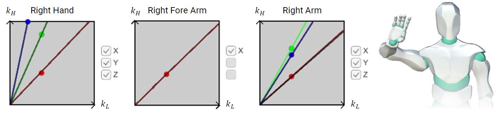
</p>

Two main elements are affected by the set of procedural rules, the **mass** and **velocity** of the obstacle. A summary of the internal and external parameters, along with a definition and description of how they affect the motion is shown below:

<p align="center">
  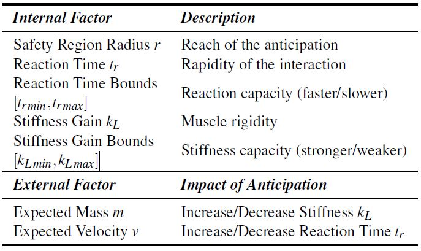
</p>

*For more information about the procedural rules to modify the character's behaviour, please refer to the paper.*

<a name="Results"></a>
## Results

The repository contains a natural environment in the scene `Scene - Outdoor Environment` containing different dynamic, non-rigid assets that the character can interact with. 

<p align="center">
  
</p>

<p align="center">
  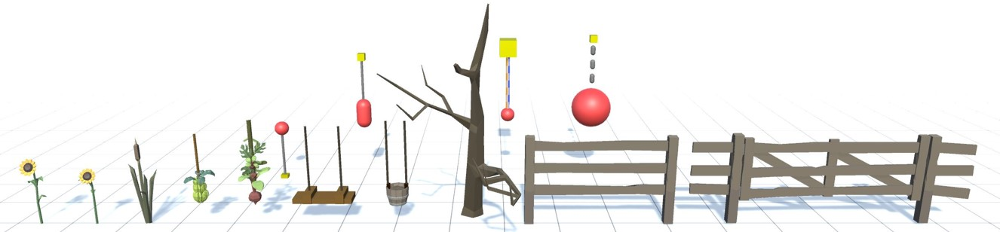
</p>

<p align="center">
  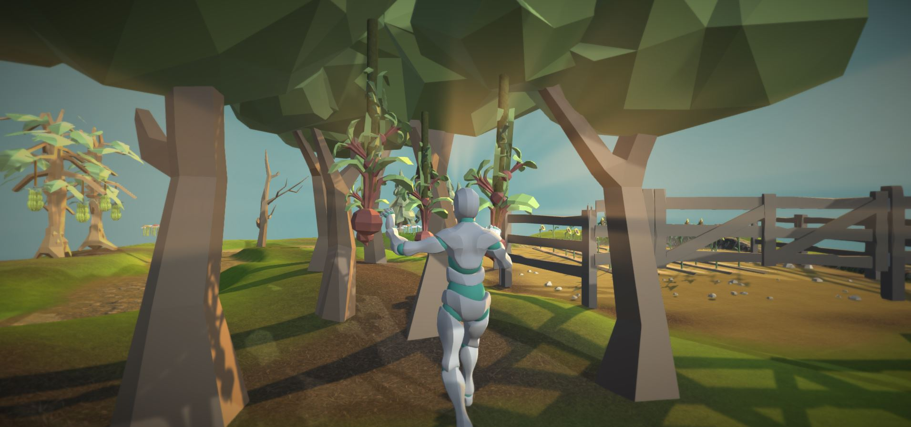
&nbsp; &nbsp;
  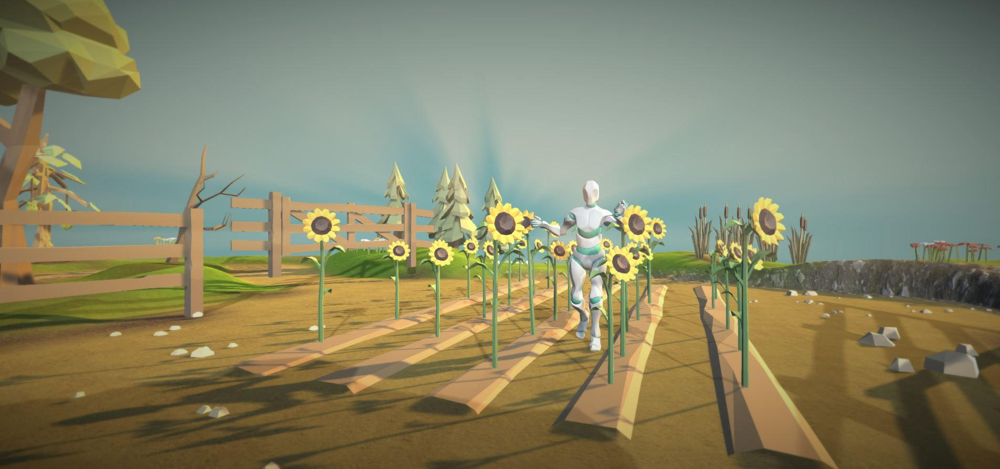
</p>

<p align="center">
  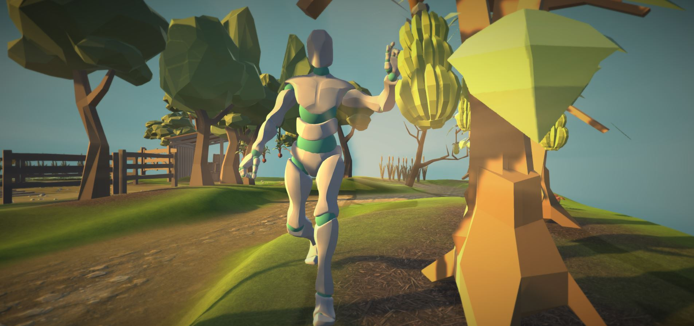
&nbsp; &nbsp;
  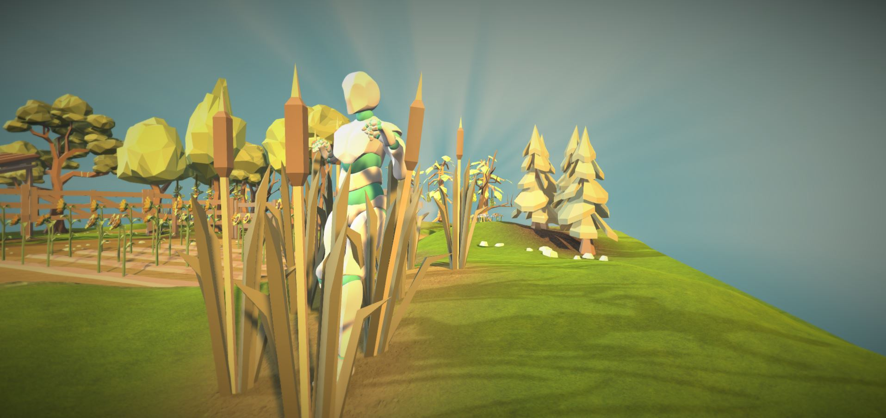
</p>

<a name="Citation"></a>
## Citation

```bibtex
@article {10.1111:cgf.14633,
journal = {Computer Graphics Forum},
title = {{Generating Upper-Body Motion for Real-Time Characters Making their Way through Dynamic Environments}},
author = {Alvarado, Eduardo and Rohmer, Damien and Cani, Marie-Paule},
year = {2022},
publisher = {The Eurographics Association and John Wiley & Sons Ltd.},
ISSN = {1467-8659},
DOI = {10.1111/cgf.14633}
}
```
<a name="Links"></a>
## Links

- [Project Page](https://edualvarado.com/generating-upper-body-motion/)
- [Paper](https://hal.inria.fr/hal-03757439v1)
- [Video](https://youtu.be/dq4FJH1atWM)

<a name="License"></a>
## License

The code is released under MIT License. See LICENSE for details.
